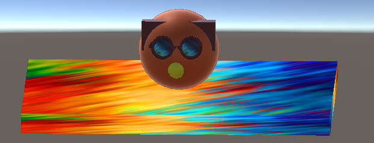
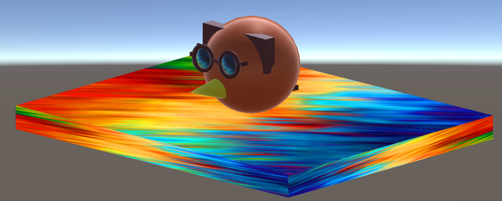

# 3D Platformer Game

## Description
This is a 3D platformer game made in Unity. The game is about a character that has to collect coins and avoid obstacles to get to the end of the level. The game is made for PC and is controlled with the keyboard.

## How to play
The game is controlled with the keyboard. The character can move with the arrow keys and jump with the space bar. The character can also double jump. The player can also use the mouse to look around.

## How to install
To install the game you need to download the zip file from the repository. Then you need to extract the zip file. After that you can open the folder and run the .exe file.

## How to build
To build the game you need to open the project in Unity. Then you need to go to File -> Build Settings. Then you need to select the platform you want to build for and press Build.

## How to contribute
To contribute to the project you need to fork the repository. Then you need to clone the repository to your computer. After that you can make changes to the project. When you are done you need to commit the changes and push them to your forked repository. Then you need to make a pull request to the original repository.

## How to report issues
To report issues you need to go to the issues tab in the repository. Then you need to press the New Issue button. Then you need to write a title and a description of the issue. Then you need to press the Submit new issue button.

---

# Screenshots

# Logo

# Website 
[NinsGameDEV](https://aynjel.github.io/3dgame/)